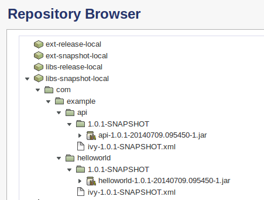
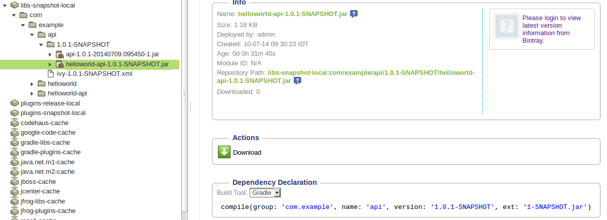

# Gradle in the real world (tutorial)

The story goes that you want to start a new OpenSource Java project with a few partners. So what do you need?

* Git repository at [github.com](github.com)
* Your Java code of course
* An build system, in this case [Gradle](gradle.org)
* And finally a Binary Repository, in this case Artifactory from [JFrog](jfrog.com)

This tutorial will walk you through the steps of setting up the build system with Gradle. 

This tutorail does not cover setting up a Github repo or setting up your Artifactory server


## create github helloworld repo

Register to github.com and create a new repo

## add first file to repo

create a new file called `HelloWorld.java`

```
package org.gradle.example.simple;

public class HelloWorld {
   public static void main(String args[]) {
     System.out.println("Hello, World");
   }
}
```

Place under the following directory:

```
mkdir new_project
cd new_project
src/main/java/org/gradle/example/simple
```
Run the following Git commands
```
git init
git add src/main/java/org/gradle/example/simple/HelloWorld.java
git commit -m "first commit hello world"
git remote add origin https://github.com/your-user/helloworld.git
git push -u origin master
```
To check the repo is in places
```
cd ..
git clone git@github.com:your-user/helloworld.git
```
## get Gradle for the first time 
First make sure your Java is setup correctly
```
java -version
```
Go to http://www.gradle.org/downloads and download the flavour you want (you can choose a version other than the latest)
(The following relates to a Linux installation, see Windows installation on the web)
* unzip gradle-X.x-bin.zip under /usr/local (e.g. /usr/local/gradle-2.0)
* add Gradle to your PATH by adding the following lines to `~/.profile`
```
# Gradle stuff
GRADLE_HOME="/usr/local/gradle-2.0"
PATH="$PATH:$GRADLE_HOME/bin"
```

## add the Gradle Wrapper to the Git repo
In order to spare your developers from having to install Gradle on their clients add the Gradle Wrapper to the Git repo and by typing `gradlew build` the installation of Gradle will be transparent to them

* create a gradle file called `install.gradle` as follows
```
task wrapper(type: Wrapper) {
    gradleVersion = '2.0'
}
```

* Run the gradle task
```
gradle -b install.gradle wrapper
```
you should get:

```
:wrapper

BUILD SUCCESSFUL

Total time: 2.883 secs
```
Once the task is completed, add the following to your git repo
```
git add  gradle/wrapper/gradle-wrapper.*  gradlew gradlew.bat
git commit -m "adding gradle wrapper"
git push
```
From this point all other developers on the project can run the Gradle scripts but using `gradlew` and this is what we will be using in the tutorial

## build our Java project with Gradle
Couldn't be easier,
Create a new file called `build.gradle`
that contains this one line:
```
apply plugin: 'java'
```
Run the build
```
./gradlew build
```
you should get:
```
:compileJava
:processResources UP-TO-DATE
:classes
:jar
:assemble
:compileTestJava UP-TO-DATE
:processTestResources UP-TO-DATE
:testClasses UP-TO-DATE
:test UP-TO-DATE
:check UP-TO-DATE
:build

BUILD SUCCESSFUL

Total time: 3.556 secs
```
Note that now you have an archive of your Java project here:
`build/libs/helloworld.jar`
Now let's commit the gradle script to Git
```
git add build.gradle
git commit build.gradle -m "adding the basic gradle script"
git push
```
## simulating a more elaborate project 
Let's say that our project is built out of two artifacts - the product itself and a thin layer API 
First create a dummy helloworld API 
```
mkdir -p api/src/main/java/org/gradle/example
cp -r src/main/java/org/gradle/example/simple api/src/main/java/org/gradle/example/api
```
change the name of the `HelloWorld.java`
```
mv api/src/main/java/org/gradle/example/api/HelloWorld.java api/src/main/java/org/gradle/example/api/HelloWorldapi.java
```
Edit the java file so it looks like so:
```
package org.gradle.example.api;

public class HelloWorldapi {
   public static void main(String args[]) {
     System.out.println("Hello, Universe");
   }
}
```
Add the file to our git repository
```
git add api/src/main/java/org/gradle/example/api/HelloWorld-api.java
git commit -a -m "adding another java file simulating an API layer"
git push
```
## Setting up gradle to build both jars 
In order for gradle to build the HelloWorld jar and the API it depends this is how it should be set up:

`settings.gradle`:
```
include 'api'
```

`build.gradle`:
```
allprojects {
        apply plugin: 'java'
}

dependencies {
       compile project(':api')
}

project (':api') {
}
```
Run the build:
```
./gradlew build
```
You should get:
```
:api:compileJava
:api:processResources UP-TO-DATE
:api:classes
:api:jar
:compileJava
:processResources UP-TO-DATE
:classes
:jar
:assemble
:compileTestJava UP-TO-DATE
:processTestResources UP-TO-DATE
:testClasses UP-TO-DATE
:test UP-TO-DATE
:check UP-TO-DATE
:build
:api:assemble
:api:compileTestJava UP-TO-DATE
:api:processTestResources UP-TO-DATE
:api:testClasses UP-TO-DATE
:api:test UP-TO-DATE
:api:check UP-TO-DATE
:api:build

BUILD SUCCESSFUL

Total time: 3.207 secs
```

Assuming the build went well, you should get the resulting jars here:
```
ls build/libs api/build/libs/
```
```
api/build/libs/:
api.jar

build/libs:
helloworld.jar

```

add the code to git:
```
git add settings.gradle
git commit -a -m "updated build.gradle and added settings.gradle to support building sub-project"
git push
```
## Making the Gradle script a little more real

### Adding a Version

Add the following to `build.gradle` under the `allprojects` section
```
      version = '1.0.1-SNAPSHOT'
```
Push to Git
Run a clean build `./gradlew clean build` 
You should get the JARs with new names
```
ls build/libs api/build/libs
```
```
api/build/libs:
api-1.0.1-SNAPSHOT.jar

build/libs:
helloworld-1.0.1-SNAPSHOT.jar
```
But of course the version changes, it should not be hard-coded within the Gradle script - so let's read it from a file 

TBD

### Building JARs to a single location
To avoid the JARs being saved in different locations, let's make sure they are saved in one directory

Add the following to `build.gradle` under the `project(':api')` section
```
project(':api') {
     tasks.withType(Jar) {
            destinationDir = rootProject.jar.destinationDir
    }
}
```
Run a clean build `./gradlew clean build` 
You should get the JARs under the one directory
```
ls build/libs
```
```
build/libs:
api-1.0.1-SNAPSHOT.jar helloworld-1.0.1-SNAPSHOT.jar
```
Push the chagne to Git 

### Adding dependencies
TBD

## Publishing to Artifactory
This tutorial does not cover setting up an Artifactory server, see JFrog's site: http://www.jfrog.com

So we assume we have an Artifactory server on [localhost:8081](localhost:8081) with the default admin user and password

As we do not want the login credentials to Artifactory in plain text in the Gradle script - let's set up a properties file in the home directory of the user
```
vi ~/.gradle/gradle.properties
```
Add these two lines to the file
```
artifactoryUser=admin
artifactoryPassword=password
```
Now let's setup the Artifactory-Gradle plugin

Add this to the start of `buld.gradle`:
```
buildscript {
    repositories {
        maven { url 'http://repo.jfrog.org/artifactory/gradle-plugins-snapshots' }
    }
    dependencies {
        classpath(group: 'org.jfrog.buildinfo', name: 'build-info-extractor-gradle', version: '2.1.x-SNAPSHOT')
    }
    configurations.classpath {
        resolutionStrategy {
            cacheDynamicVersionsFor 0, 'seconds'
            cacheChangingModulesFor 0, 'seconds'
        }
    }
}
```
Now let's setup the connection to our Artifactory server and the configuration set we want published

Add this to the `buld.gradle` file within the `allprojects` section:


```
    apply plugin: 'artifactory'

    artifactory {
        contextUrl = 'http://localhost:8081/artifactory'
        publish {
            repository {
                repoKey = 'libs-snapshot-local'
                username = artifactoryUser
                password = artifactoryPassword
                ivy {
                    ivyLayout = '[organization]/[module]/ivy-[revision].xml'
                }
            }
            defaults {
                publishConfigs('published')
            }
        }
    }

    project.ext.set("rootProduct", rootProject.name)

    group = 'com.example'

    configurations {
        published
    }
    artifactory {
        publish {
                defaults {
                        publishConfigs('published')
                }
        }
    }
    artifacts {
        published jar
    }
```
Now, running `./gradlew clean build` should work as usual, but when you run `./gradlew artifactoryPublish` right after your should get:
```
:artifactoryPublish
Deploying artifact: http://localhost:8081/artifactory/libs-snapshot-local/com/example/api/ivy-1.0.1-SNAPSHOT.xml
Deploying artifact: http://localhost:8081/artifactory/libs-snapshot-local/com/example/helloworld/1.0.1-SNAPSHOT/helloworld-1.0.1-SNAPSHOT.jar
Deploying artifact: http://localhost:8081/artifactory/libs-snapshot-local/com/example/helloworld/ivy-1.0.1-SNAPSHOT.xml
Deploying artifact: http://localhost:8081/artifactory/libs-snapshot-local/com/example/api/1.0.1-SNAPSHOT/api-1.0.1-SNAPSHOT.jar
Deploying build info to: http://localhost:8081/artifactory/api/build

BUILD SUCCESSFUL

Total time: 6.938 secs
```
And should look like this Artifactory:


### Naming the API JAR helloworld-api.jar
We would like to reach a stage where we have two jars:

* helloworld-1.0.1-SNAPSHOT.jar
* helloworld-api-1.0.1-SNAPSHOT.jar

published to Artifactory

First let's start by making sure the api JAR is created under the correct name

To do so, make sure the :api project section looks like this:

```
project(':api') {
    tasks.withType(Jar) {
        baseName = rootProject.name
        appendix = 'api'
        destinationDir = rootProject.jar.destinationDir
    }
}
```
Now run a clean build `./gradlew clean build` and you will get:

```
$ ls build/libs/
helloworld-1.0.1-SNAPSHOT.jar  helloworld-api-1.0.1-SNAPSHOT.jar
```

But when publishing to Artifactory with `./gradlew artifactoryPublish` you will get the Artifact published incorrectly:



Note the SNAPSHOT not converted to the time-stamp and the incorrecet version and extention in the Gradle Dependency declaration

To resolve this we need to set a new property **archivesBaseName**, so that the :api project section should look like this:

```
project(':api') {
    tasks.withType(Jar) {
        baseName = rootProject.name
        appendix = 'api'
        project.ext.set("archivesBaseName", rootProject.name+"-api")
        destinationDir = rootProject.jar.destinationDir
    }
}
```